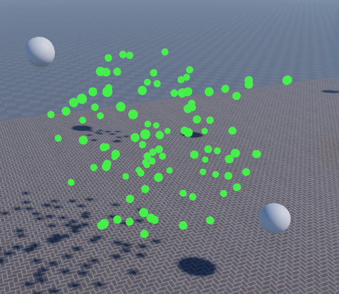
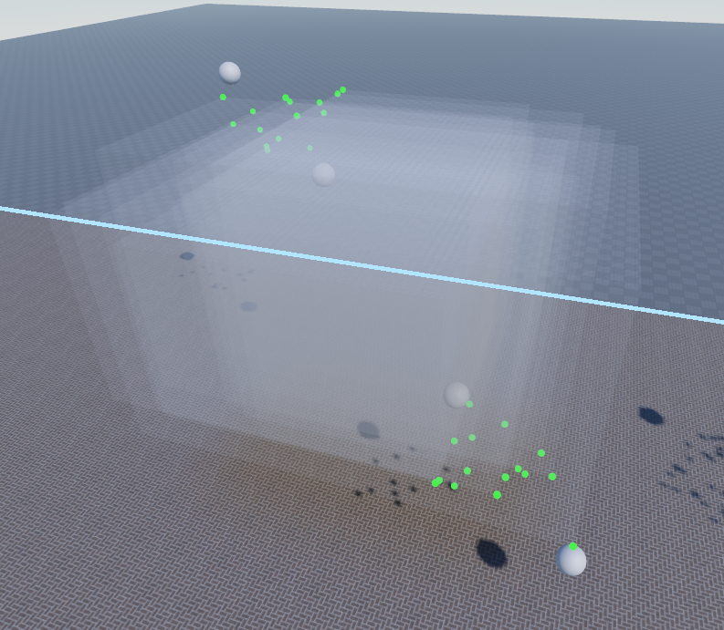

# 🎲 Roblox-Studio-Randoms 🎲
A very simple random value generator for Roblox Studio.

## Random Vector3's

<div align="center">
   
</div>

## Random Region3's

<div align="center">
   
</div>

## **📌 How To Use**

1. Download `Randoms.lua`
2. Drag the file into your Roblox Studio Experience
3. Put `Randoms` anywhere under `ServerStorage`
4. Import using
   
```lua
require(ServerStorage:WaitForChild("Randoms"))
```
Replacing `ServerStorage` with the correct directory

## **📌 For Vector3's**

- `vec1 & vec2` must be Vector3's

```lua
Randoms.randomVec3(vec1, vec2)
```

## **📌 For Region3's**

- `region1 & region2` must be Region3's
- `fixedx & fixedy & fixedz` must be bools

```lua
Randoms.randomRegion3(region1, region2, fixedx, fixedy, fixedz)
```
